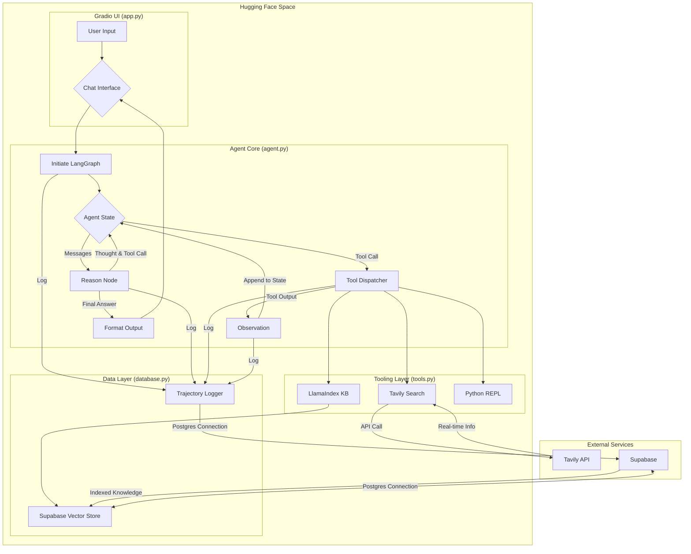

# A Production-Ready ReAct Agent: Architecture, Code, and Deployment Guide

## 1. System Overview & Strategic Rationale

### Introduction

This document outlines the architecture of a high-performance, multi-tool autonomous agent. The system is engineered to function as a sophisticated assistant capable of complex reasoning and task execution. Its core design allows it to intelligently delegate queries between a private, long-term knowledge base and real-time internet search. Furthermore, it possesses the capability to execute code for computational and data manipulation tasks. The architecture is built on a modern, high-performance technology stack, designed for scalability, maintainability, and low-latency interactions, making it suitable for production deployment on platforms like Hugging Face Spaces.

### Technology Stack Justification

The selection of each component in the technology stack was a strategic decision aimed at optimizing performance, control, and extensibility.

**Groq (LLM Inference Engine)**: The agent's reasoning capabilities are powered by the Groq API. Groq utilizes a proprietary Language Processing Unit (LPU) architecture, which delivers exceptionally low-latency inference. In an agentic system where a single user query can trigger multiple sequential LLM calls within a ReAct loop, minimizing inference time is not a luxury but a critical requirement for a responsive user experience. Groq's speed ensures the agent's "thought" process is nearly instantaneous, preventing user frustration and enabling more complex, multi-step reasoning within a reasonable time frame.

**LangGraph (Stateful Agent Logic)**: The core of the agent's operational logic is built using LangGraph. LangGraph provides a framework for creating stateful, graph-based applications, which is a natural and powerful paradigm for implementing the cyclic nature of the ReAct (Reasoning and Acting) framework. Unlike simpler, linear chains, LangGraph allows for the explicit definition of nodes (computational steps) and edges (control flow), including conditional logic. This is essential for building a robust agent that can loop, make decisions, and recover from errors. It provides the necessary control to manage the agent's state, including its message history and intermediate observations, throughout the execution cycle.

**LlamaIndex & Supabase (Knowledge Base & Long-Term Memory)**: This combination serves as the agent's persistent, long-term memory. Supabase offers a scalable, managed PostgreSQL database that includes the pgvector extension, a critical component for efficient vector similarity searches. LlamaIndex provides a high-level Python framework that abstracts the complexities of data ingestion, indexing, and retrieval. By connecting LlamaIndex to the Supabase vector store, we create a robust knowledge base that the agent can query to answer questions based on private, pre-indexed data. This offloads domain-specific knowledge from the LLM's context window and provides a reliable source of factual information.

**Tavily Search (Real-Time Search & Memory)**: To overcome the inherent limitation of an LLM's static knowledge cutoff, the Tavily Search API is integrated as a primary tool. Tavily is optimized for AI agents, providing clean, concise search results that are directly useful for LLM consumption. This tool grants the agent access to the live internet, enabling it to answer questions about current events, recent developments, or any topic not contained within its static Supabase knowledge base. The agent is designed to autonomously decide whether a query requires real-time information from Tavily or historical context from its LlamaIndex-managed memory.

### Adherence to "smol-agent" Design Philosophy

While this project does not use the smolagents library directly, its architectural design is heavily inspired by the "smol-agent" philosophy of simplicity, modularity, and clarity. This philosophy advocates for avoiding monolithic scripts and complex abstractions in favor of a clean, maintainable codebase where each component has a distinct responsibility.

This principle is realized through a strict separation of concerns within the project structure:
- `agent.py`: Contains only the definition of the LangGraph agent—its state, nodes, and edges.
- `tools.py`: Centralizes the definition and configuration of all tools available to the agent.
- `database.py`: Manages all interactions with the Supabase data layer, including client connections and schema definitions.
- `app.py`: Serves as the application entry point, responsible for wiring the components together and presenting the user interface (Gradio).

This modular structure makes the system easier to understand, debug, and extend. Adding a new tool, for example, only requires a modification to `tools.py`, without altering the core agent logic in `agent.py`.

## 2. The ReAct Framework Implementation in LangGraph

The ReAct (Reason + Act) paradigm is a powerful framework for enabling language models to solve complex tasks by synergizing their internal reasoning capabilities with external actions (tool use). Our system implements this framework using LangGraph's stateful graph structure. The iterative ReAct loop is mapped directly to the components of our graph.

**Thought (Reason)**: This corresponds to a call to the Groq LLM within a primary node in our graph. The agent is prompted to first reason about the user's query in the context of the conversation history and the available tools. The model generates a rationale for its plan, such as "The user is asking about current events, so I should use the Tavily search tool." This verbalized reasoning trace is a cornerstone of the ReAct framework, providing transparency into the agent's decision-making process. This thought, along with any subsequent action, is added to the agent's state.

**Act (Action)**: This is the agent's decision to use a tool. In our implementation, this is represented by the Groq model outputting a structured ToolCall object, which specifies the name of the tool to use and the arguments to pass to it. LangGraph's conditional routing then directs the state to a dedicated ToolNode.

**Observation**: This is the data returned from the execution of a tool. For instance, it could be the search results from Tavily or a retrieved document chunk from the LlamaIndex knowledge base. This new piece of information is then fed back into the graph, where it is appended to the agent's state as an observation.

The agent's state, particularly its list of messages, functions as the "scratchpad" described in the ReAct methodology. It accumulates the history of thoughts, actions, and observations, providing the full context for the next reasoning step. This is achieved elegantly in LangGraph by defining the messages field in the AgentState with a reducer function (specifically, the pre-built add_messages helper). When a node returns a new message, this reducer ensures it is appended to the existing list rather than replacing it, thus preserving the full trajectory of the agent's work.

This Thought -> Act -> Observation sequence forms a cycle within the LangGraph. A conditional edge, `should_continue`, inspects the most recent message from the LLM. If the message contains a ToolCall, the graph routes to the ToolNode to execute the action. If it does not, the agent has determined it has sufficient information and routes to the END node, concluding the loop and generating a final answer for the user. This iterative process allows the agent to decompose complex problems, gather information step-by-step, and adapt its plan based on new observations.

## 3. Data and Logic Flow Diagram

### Diagram Flow Explanation:
1. A User Input is received through the Gradio Chat Interface (app.py).
2. The interface initiates the LangGraph agent (agent.py), creating a unique run_id for the interaction and populating the initial Agent State.
3. The Reason Node receives the current state and makes a call to the Groq LLM. The LLM generates a thought and, if necessary, a ToolCall. This output updates the state.
4. A conditional edge checks the state. If a ToolCall exists, control is passed to the Act Node (Tool Dispatcher).
5. The Tool Dispatcher (tools.py) invokes the appropriate tool based on the ToolCall's name: Tavily Search, the LlamaIndex KB Tool, or the Code Interpreter.
6. The selected tool may interact with an External Service (Tavily API or Supabase).
7. The tool's output is returned as an Observation.
8. The observation is appended to the Agent State, and control loops back to the Reason Node for the next step.
9. This cycle repeats until the LLM produces a response without a ToolCall.
10. The final response is formatted and sent back to the Gradio UI.
11. Throughout this process, the Trajectory Logger (database.py) captures key events (Reason, Action, Observation) and persists them to a dedicated logging table in Supabase for observability.

## 4. State Management and Trajectory Logging

### AgentState Schema

The agent's state is the lifeblood of the LangGraph application. It is defined as a TypedDict to ensure type safety and clarity.

- `messages`: A list of LangChain BaseMessage objects. This serves as the ReAct "scratchpad," storing the complete history of user inputs, AI thoughts, tool calls, and tool observations. It is annotated with add_messages to ensure new messages are appended rather than overwriting the history.
- `run_id`: A UUID that uniquely identifies a single end-to-end execution of the graph. This is essential for grouping related log entries.
- `log_to_db`: A boolean flag to control whether the trajectory for a given run should be persisted to the database. This is useful for debugging or selective logging.

### Observability via Trajectory Logging

Standard application logging (e.g., printing to stdout) is insufficient for debugging complex agentic behavior. To understand why an agent made a particular decision, one must be able to reconstruct the exact state and context it had at that moment. Our architecture implements a robust observability layer by logging the agent's entire trajectory to a structured database table in Supabase.

This is achieved using a custom Python logging.Handler. The handler is configured to intercept specific, structured log records emitted from the agent's nodes. Each log record contains the run_id, the type of step (REASON, ACTION, OBSERVATION), and a JSONB payload with the relevant data. This approach transforms the ephemeral reasoning process of the agent into a persistent, queryable asset. It allows developers to perform detailed post-hoc analysis, answer critical questions about agent behavior, and build trust in the system's decisions.

The design of this logging system provides immense value. By querying the `agent_trajectory_logs` table, a developer can easily trace the entire thought process for any given user interaction, making it possible to identify the root cause of failures, evaluate the effectiveness of tool descriptions, and gather data for future fine-tuning efforts.

### Database Schema

| Column Name | Data Type | Description |
|-------------|-----------|-------------|
| log_id | BIGSERIAL | Auto-incrementing primary key for the log entry. |
| run_id | UUID | Foreign key to group all steps of a single agent run. |
| timestamp | TIMESTAMPTZ | The exact time the log entry was created. |
| step_type | TEXT | The type of agent step (e.g., 'REASON', 'ACTION', 'OBSERVATION', 'FINAL_ANSWER'). |
| payload | JSONB | A flexible JSON object containing the step's data (e.g., LLM's thought, tool call details, tool output). | 